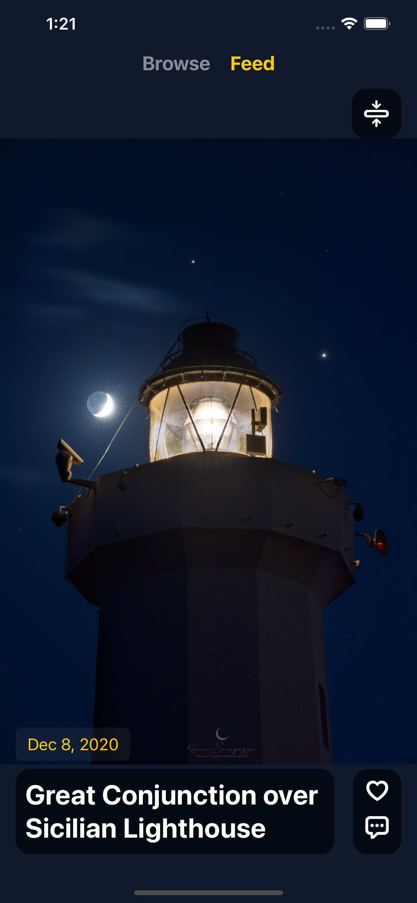
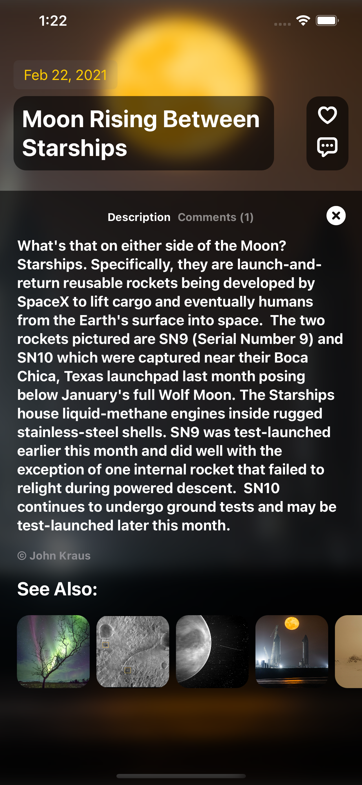
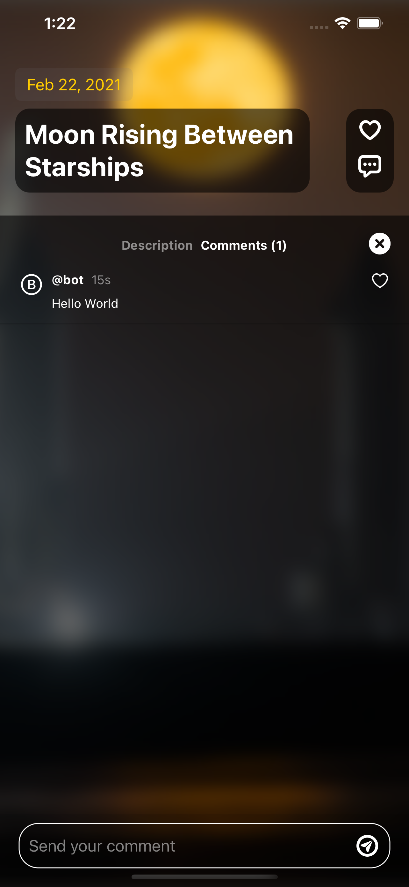

# apod_client

This application is meant to be used as A Picture A Day service. It is a WIP and only works with the NASA APOD api.

More Features to come.

## Screenshots
   

## Technology Used

- Swift
- SwiftUI
- Animations
- URLSession
- Codable Data
- ObservedObjects
- SDWebImageSwiftUI
- Xcode 12.5

## Supported Platforms

* iOS 13.0+
* macOS 10.15+

## License

MIT
